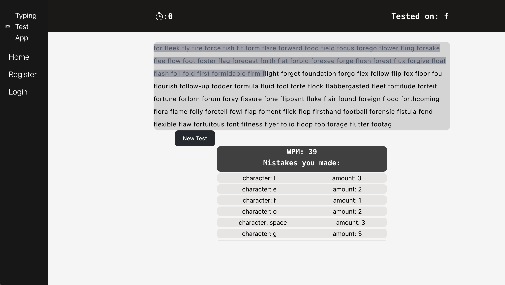
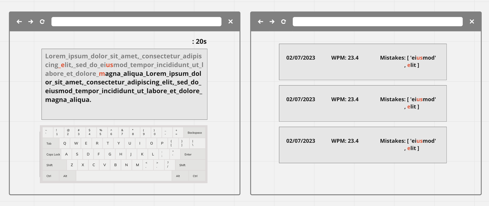
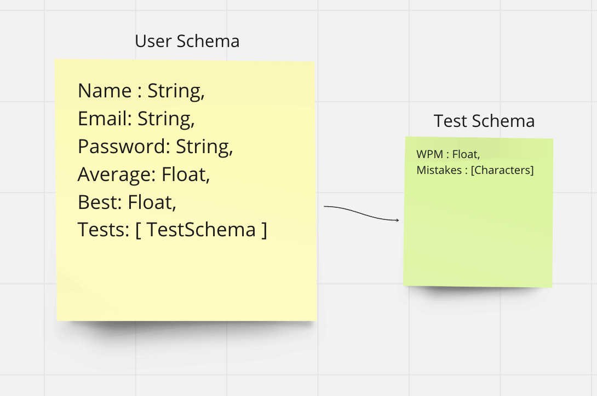

# Project-4
Typing Test App
## App Description
This is typing test app! You can test your typing speed and plan to improve your accuracy and speed. Through creating a profile and taking a few tests you will get more tests suggested based off of areas of improvements you might need. 

## TechStack
* TypeScript
* Node.js
* Express.js
* Bcrypt
* JSON Web Token 
* JWT.decode
* MongoDB
* Mongoose

## Project 

## Wireframes

## Restful routing chart and ERD

## User Stories
* As a user, I would like to be able to sign up for an account or sign in
* As a user, I would like to be able to take a time typing test and receive the WPM
* As a user, I would like to get suggested tests based off of the mistakes from my previous tests
* As a user, I would review my old tests and see the improvement statistics

## MVP GOALS
* Allow users to sign up for an account/create an account
* Allow users to update their passwords
* Allow users to delete their accounts
* Allow users to take a timed typing test and display results
* Allow users to see their previous tests and results
* Suggest tests with similar words to errors made from previous tests

## Stretch Goals
* Display Top scores across all users on a home page (ranking top 10 WPM)
* Implement Socket.io to allow users to race against each other in typing tests

## Project Timeline
* 02/10 - set up Express server, Mongoose Schemas, React client side with Typescript.
* 02/11 - start stubbing out backend routes to perform all needed actions.
* 02/12 - Read up and refresh on user Auth to work on logging in from client side
* 02/13 - Start on React components for typing test on client side
* 02-14 - Finish any unfinished logic from the previous day, and get started on logic to suggest tests based on errors from tests
* 02/15 - Finish any unfinished logic from the previous day, get started on stretch goals or styling
* 02/16 - Finish polishing up anything needed and deploy

## General Approach
I initially started with learning how to set up the typical node server, mongoose schema's, and react app with Typescript. I encountered some issues along the way of setting up the structure of the project but quickly figured it out with the help of Google. After having my servers up and running on Typescript, I went on to tackle the user auth. I encountered some issues trying to use the typical packages that I was used to using in just Javascript for user Auth so I spent some time researching finding the Typescript version of some of those packages or finding ways to just configure Typescript to work with them. 

Once I finally had the basic boilerplate down for my project, I went on to plan out the client side of the project. I started with getting more comfortable with Typescript with React by getting the login and register components out of the way quickly. Once I had a little better understanding of the tech stack I went on to whiteboard out the logic of the typing test itself. Once I felt comfortable with the logic that I had planned out I tried implementing it, I obviously ran into many unforeseen issues but started debugging them along the way to finally reach the MVP of my project.

## Unsolved Problems & Major Hurdles 
* I have yet to write out logic on how to show typing mistakes as a user is taking the test, my logic only shows what index they currently are on as they type but not where they mess up.
* A major hurdle I had was just getting more comfortable with React and useEffect, I ran into multiple issues with useEffect but overall learnt from it.

